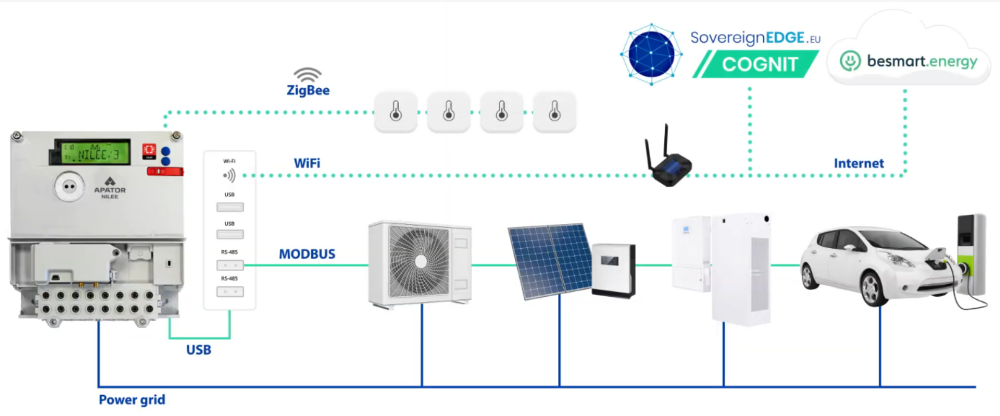

# Cognit Energy Use Case Basic Demo

This is the demonstratory environment of the Energy Use Case of the COGNIT project. To learn more about COGNIT visit its [website](https://cognit.sovereignedge.eu/).

## What is the Demo about?

The Energy Use Case (UC) undertakes a goal to optimize the management of energetically important devices in a household. For the end user we would like to:

* maximize the usage of green energy,
* reduce the amount of energy taken from the grid.

We develop the application (later called the *userapp*) that controls the household devices, and run it on a Smart Energy Meter (SEM). The application uses an AI model to make decisions concerning the managing of the devices, but since SEM has very constrained resources, the execution of the AI model inference and training is offloaded to the COGNIT framework.

The architecture of the Demo is well illustrated in the following diagram:


In our demo setup we include the following types of devices:

* photovoltaic installation (PV),
* electric vehicle charger (EV),
* heating facility,
* energy storage,
* so called "uncontrolled consumption", which sums up all the other devices consuming energy.

## Structure of the Demo

We have been developing a couple of other repositories that build the Demo:

* [use-case-3-sem-simulator](https://github.com/SovereignEdgeEU-COGNIT/use-case-3-sem-simulator) – a basic simulation of SEM metrology written in C language,
* [use-case-3-home-energy-management](https://github.com/SovereignEdgeEU-COGNIT/use-case-3-home-energy-management) – contains the decision-making algorithm used to optimize energy management at a household and the simulation models of the energetically important household devices. These devices' simulators communicate with the SEM simulator, so that SEM outputs accurate metrological data,
* [use-case-3-phoenix-demo](https://github.com/SovereignEdgeEU-COGNIT/use-case-3-phoenix-demo) – the userapp controlling the devices and offloading the AI model to COGNIT. It is based on the [Phoenix-RTOS](https://github.com/phoenix-rtos/phoenix-rtos-project) and can be run using QEMU on ia32 architecture or on an actual SEM.

In this repository we provide the Python scripts to set up, start and control the demo simulation. This can be done in two flavors:

* With the use of **external userapp in C** from `use-case-3-phoenix-demo` – the simulation of the devices is started together with the SEM simulator metrology. Additionally the Modbus servers are set up, so that the application in the phoenix-demo can communicate with the devices. The communication can be done either via a socket (if phoenix-demo runs in QEMU) or via a serial port (when phoenix-demo runs on an actual SEM). Communication with COGNIT framework is done solely on the phoenix-demo side, with the help of [device-runtime-c](https://github.com/SovereignEdgeEU-COGNIT/device-runtime-c). This solution strives to faithfully resemble the real-life scenario and thus can be run on a physical SEM device.
* With the use of the **local userapp in Python** – the phoenix-demo is not used, but rather the userapp in `user_app.py` in this repository. The communication with COGNIT is done via [device-runtime-py](https://github.com/SovereignEdgeEU-COGNIT/device-runtime-py). This solution is more suitable for testing functionalities of the COGNIT framework (e.g. in terms of its scalability).

## Running the Demo

The demo is able to simulate multiple households in parallel (see the description of the configuration files below).

To prepare the environment please follow the steps:

* Prepare Python virtual environment:

```bash
python3 -m venv demo_venv
source demo_venv/bin/activate
pip3 install -r requirements.txt
```

* Inside this directory put the COGNIT runtime config file `cognit.yml` (with all the necessary authorization data).

In order to run the demo call:

```bash
python3 multi_demo_runner.py
```

### Logging

For each demo process log files are produced inside `log/{pid}/{device_id}` directory:

* `simulation.log` – current state of the devices and the simulation environment
* `user_app.log` – input and output of the decision algorithm (only when using local userapp)
* `cognit.log` – COGNIT Serverless Runtime device API logs (only when using local userapp)

Additionally in file `log/cognit.log` all the instances register each offload action and whether offloading succedeed (also only when using local userapp).

### Configuration and scenario

The general (global) configuration of the demo can be found in `scenario/config.json`. The detailed definitions of simulation, user application and devices for specific household and smart energy meter can be found in `{sem_id}.json`.

```{note}
The `sem_id` is the id of the household scenario. The `device_id` is a unique identifier of a simulation instantion and it is constructed as `{sem_id}_{some_number}`, so it is easy to infer `sem_id` from `device_id`.
```

The most important **global** parameters are:

* `START_DATE` - start date of the simulation,
* `SPEEDUP` - the speedup factor of the simulation,
* `SEM_ID_LIST` - list of IDs of smart energy meters, pointing to the specification files,
* `SEM_NUM` - number of simulation instances to run.

The most important **per household** parameters are:

* `USER_APP_CYCLE_LENGTH` – time (in "virtual" seconds) between consecutive calls of the decision algorithm,
* `TRAIN_CYCLE_LENGTH` - time (in "virtual" seconds) between subsequent evaluation executions of the trained AI model and, depending on its result, training a new one (ignored when using baseline version of algorithm),
* `SIMULATION_CONFIG.local_userapp` – boolean that defines what kind of userapp will be used for specific SEM. If `true` then local `user_app.py` is used, otherwise phoenix-demo application should be set up separately,
* `SIMULATION_CONFIG.modbus_dev` – (used only when `SIMULATION_CONFIG.local_userapp` is `false`) path of the modbus device to communicate with the phoenix-demo application.

Files `scenario/config.toml` and `scenario/updates.csv` are SEM Simulator config files (see appropriate repository README for more details).

### Dynamic changes of user preferences

In order to be able to dynamically change (some) user preferences, use the interactive Python to start the simulation:

```bash
python3 -i multi_demo_runner.py
```

Then, one would be able to call the following functions for each SEM, regardless of whether the SEM uses local or external userapp.

```python
# The `id` argument refers to the index on the housholds list

offload_decision_now(id: int)  # Triggers decision algorithm offloading immediately.

offload_training_now(id: int)  # Triggers training algorithm offloading immediately.

set_decision_cycle(id: int, cycle_sec: int)  # Sets the frequency of decision making.

set_training_cycle(id: int, cycle_sec: int)  # Sets the frequency of the training.
```

## Running the Demo using `docker`

The demo can be run with the help of the `Dockerfile` provided in this repository.
